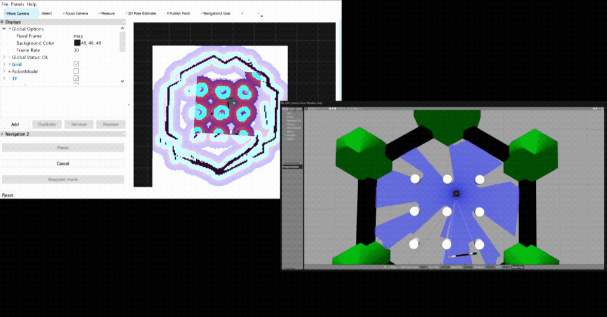

[**Navigation 2**][nav2] is the next generation ROS Navigation stack for ROS 2.
Edge robotics team at Microsoft has bootstrapped a Windows port for **Navigation 2**.
This short guide shows you how to build **Navigation 2** from source and later you can get started with **Navigation 2** exercises.



## Objectives

  * Exercise the ROS 2 Windows installation.
  * Bootstrap an environment running **Navigation 2** samples.

## Prerequisites

> The instructions can be found on [`http://wiki.ros.org/Installation/Windows`](http://wiki.ros.org/Installation/Windows).

  * ✔ 64-bit (amd64) environment of `Windows 10 Desktop`.
  * ✔ `Visual Studio 2019` with `Desktop development with C++` workload included.
  * ✔ `Chocolatey` package manager installed.
  * ✔ `Git` source control software installed.
  
## Installing ROS 2 on Windows

1. From the start menu, look for [`x64 Native Tools Command Prompt for VS 2019`][vsdevcmd].
2. Open the command prompt as administrator.
3. Run the following to install `ROS 2 Eloquent` and `Gazebo 9`.

```Batchfile
mkdir c:\opt\chocolatey
set ChocolateyInstall=c:\opt\chocolatey
choco source add -n=ros-win -s="https://roswin.azurewebsites.net/api/v2" --priority=1
choco upgrade ros-eloquent-desktop gazebo9 -y --execution-timeout=0 --pre
```

You can close the command prompt now.

✔ Now you have ROS 2 `ros-eloquent-desktop` and `gazebo9` nightly build installed. 

## Create bootstrap script

Open your favorite editor and create a file `bootstrap.bat` under `c:\opt\ros\eloquent\x64\bootstrap.bat` with the following content:

```Batchfile
set "ChocolateyInstall=c:\opt\chocolatey"
set "PATH=C:\opt\python37amd64\DLLs;C:\opt\python37amd64\;C:\opt\python37amd64\Scripts;c:\opt\vcpkg\installed\x64-windows\bin;c:\opt\vcpkg;c:\opt\rosdeps\x64\bin;C:\opt\rosdeps\x64\lib;%PATH%"
call "C:\opt\ros\eloquent\x64\local_setup.bat"
call "C:\opt\rosdeps\x64\share\gazebo-9\setup.bat"
set "CMAKE_PREFIX_PATH=c:\opt\vcpkg\installed\x64-windows;c:\opt\rosdeps\x64;%CMAKE_PREFIX_PATH%"
set "ROS_PACKAGE_PATH=C:\opt\ros\eloquent\x64\share"
set "ROS_ETC_DIR=C:\opt\ros\eloquent\x64\etc\ros"
```

## Open a Developer Command Prompt

1. From the start menu, look for [`x64 Native Tools Command Prompt for VS 2019`][vsdevcmd].
2. Run the shortcut as administrator.
3. Once the developer command prompt is open, run

```
c:\opt\ros\eloquent\x64\bootstrap.bat
```

Now you are in the ROS 2 Developer command prompt.
Stay in this command prompt for the rest of this tutorial.

## Create a Navigation 2 Workspace

Create a empty workspace to contain the Navigation 2 project, and then resolve the additional dependencies.

```Batchfile
:: create a empty workspace
mkdir c:\nav2_ws\src
pushd c:\nav2_ws

:: checkout the required source code.
wget https://raw.githubusercontent.com/ms-iot/ROSOnWindows/master/docs/ros2/navigation2.repos
vcs import src < navigation2.repos

:: evaluate and resolve any additional dependencies
rosdep update
rosdep install --from-paths src --ignore-src -r -y

:: manually install google-test
choco install google-test -y

:: manually install sdl2-image
vcpkg install sdl2-image:x64-windows
```

## Build and Activate the Navigation 2 Workspace

Build the workspace by colcon, and then activate the install space.

```Batchfile
:: change to the root of workspace
pushd c:\nav2_ws

:: build the workspace
colcon build --cmake-args -DBUILD_TESTING=OFF --cmake-target install

:: activate it
install\setup.bat
```

Now you are in the Navigation 2 activated environment.

## Explore Navigation 2 Samples

There are many **Navigation 2** resources online.
Here we share some good starting points:

* [TurtleBot3 ROS 2 Simulation: Virtual SLAM and Virtual Navigation][turtlebot3ros2]
* [Navigation 2][nav2]


[nav2]: https://ros-planning.github.io/navigation2/
[turtlebot3ros2]: http://emanual.robotis.com/docs/en/platform/turtlebot3/ros2_simulation/#ros-2-simulation
[vsdevcmd]: https://docs.microsoft.com/en-us/dotnet/framework/tools/developer-command-prompt-for-vs
