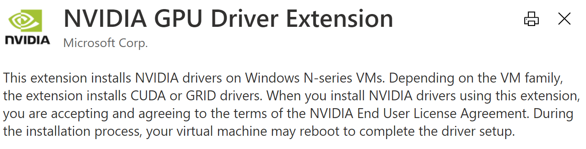

This tutorial is to show how to use `Azure Pielines` with `Scale Set Agents` to exercise the [Navigation2 System Tests](https://github.com/ros-planning/navigation2/tree/main/nav2_system_tests).
It is a comprehensive End-to-End test pass with Gazebo simulation.
This project is a good example for ROS 2 developers how to organize a End-to-End tests across multiple packages and tools.

## Objectives

* Run and observe the Nav2 system tests running locally.

* Register a scale set agent with your Azure DevOps orgnization.

* Integrate a GitHub project with Azure Pipelines.

## Prerequisites

An Microsoft Azure account from [https://portal.azure.com](https://portal.azure.com).

An Azure DevOps account from [https://dev.azure.com](https://dev.azure.com).

A GitHub account from [https://github.com](https://github.com).

## Exercise 1: Build And Run Nav2 System Tests Locally

1. [`Install ROS2`](../GettingStarted/SetupRos2.md). `Foxy` is recommended.

2. Open the ROS 2 command prompt and activate the Gazebo environment.

```Batchfile
c:\opt\ros\foxy\x64\setup.bat
c:\opt\ros\foxy\x64\share\gazebo\setup.bat
set SDF_PATH=c:\opt\ros\foxy\x64\share\sdformat\1.6
```

3. Create an empty workspace and clone the Navigation2 repositories. For example,

```Batchfile
:: create an empty workspace
mkdir c:\nav2_ws\src
cd c:\nav2_ws

:: clone the Navigation2
curl https://raw.githubusercontent.com/ms-iot/ROSOnWindows/master/docs/ros2/navigation2_foxy.repos -o navigation2_foxy.repos
vcs import src < navigation2_foxy.repos
```

4. Build the Navigation2 System Tests projects.

```Batchfile
:: then, build the nav2_system_tests
colcon build --packages-select nav2_system_tests
```

A few moment later, a similar message should be put to indicate a successful build:

```
Summary: 1 package finished [2min 10s]
```

> In cases of any build failures, `Log` folder can be found under the workspace. Detailed information can be found there.

5. Run the Nav2 System Tests

```Batchfile
colcon test --packages-select nav2_system_tests
```

6. Verify the test result.

```Batchfile
colcon test-result
```

## Exercise 2: Create and Register Scale Set Agents with Azure Pipelines

One of the advantages to use `Scale Set Agents` is that the machine usage can scale out on demend and scale in when idle.
It is managed by Azure DevOps, and the cost saving can be more optimized.

1. Navigate to [Azure virtual machine scale set agents](https://docs.microsoft.com/en-us/azure/devops/pipelines/agents/scale-set-agents?view=azure-devops).

2. In the instructions, you will be asked to create a `Virtual Machine Scale Set`.
   Use `Visual Studio Enterprise 2019` image and [`NV-series`](https://docs.microsoft.com/en-us/azure/virtual-machines/nv-series) virtual machines.

    * The image URN is `microsoftvisualstudio:visualstudio2019latest:vs-2019-ent-latest-ws2019:latest`.

    * The virtual machine size is `Standard_NV6`. GPU-accelerated VM is required to run the simulation.

3. In this example, we use GPU accelerated VM and the corresponding driver is required in the Virtual Machine Scale Set.
   Navigate to the `Extension` settings for your Virtual Machine Scale Set and add the following extension.



4. Now, a new agent pool should be registered for your Azure DevOps organization and project.

> Keep a note of your agent pool name.

## Exercise 3: Integrate GitHub projects with Azure Pipelines

1. Create a repository into your GitHub account.

2. Create a file `azure-pipelines.yml` under the repository root with the following content.
   (Replace the pool with your agent pool name.)

```yaml
jobs:
- job: Nav2SystemTests
  pool: 'VS2019-GPU'
  timeoutInMinutes: 360
  workspace:
    clean: all
  steps:
  - script: |
      rd /s /q c:\opt 2>&1
      exit 0
    displayName: 'Remove opt folder'
  - powershell: |
      $env:ChocolateyInstall="c:\opt\chocolatey"
      Set-ExecutionPolicy Bypass -Scope Process -Force;
      iex ((New-Object System.Net.WebClient).DownloadString('https://chocolatey.org/install.ps1'))
      choco sources add -n=roswin -s https://aka.ms/ros/public --priority 1
      choco install ros-foxy-desktop -y --pre --no-progress -i
    displayName: 'Install ROS 2 Foxy'
  - script: |
      mkdir C:\Users\AzDevOps\.gazebo\models
      call "C:\Program Files (x86)\Microsoft Visual Studio\2019\Enterprise\VC\Auxiliary\Build\vcvars64.bat"
      call "c:\opt\ros\foxy\x64\setup.bat"
      call "c:\opt\ros\foxy\x64\share\gazebo\setup.bat"
      set "SDF_PATH=c:\opt\ros\foxy\x64\share\sdformat\1.6"
      mkdir nav_ws\src
      cd nav_ws
      curl https://raw.githubusercontent.com/ms-iot/ROSOnWindows/master/docs/ros2/navigation2_foxy.repos -o navigation2_foxy.repos
      vcs import --force src < navigation2_foxy.repos
      colcon build --packages-select nav2_system_tests
      colcon test --packages-select nav2_system_tests --event-handlers console_direct+
      colcon test-result
    displayName: 'Build and run tests'
    continueOnError: true
    timeoutInMinutes: 30
  - task: PublishTestResults@2
    inputs:
      testRunner: 'jUnit'
      testResultsFiles: '**\*.xml'
      searchFolder: $(System.DefaultWorkingDirectory)/nav_ws/build/nav2_system_tests/test_results
    condition: always()
  - task: PublishBuildArtifacts@1
    inputs:
      pathtoPublish: .\nav_ws\log
      artifactName: 'logs'
    condition: always()
```

2. The [`Integrate Your GitHub Projects With Azure Pipelines`](https://www.azuredevopslabs.com/labs/azuredevops/github-integration/) guides you how to create a pipeline for a GitHub project in Task 1 & 2.
   Use your fork as the target repository.
3. Navigate to the "Existing Azure Pipelines YAML file" and select `azure-pipelines.yml`.
4. Now you should have a pipeline running (or ready to run).

In the meanwhile, you can observe the pipeline running. Once the build finishes, you can inspect the test results.
